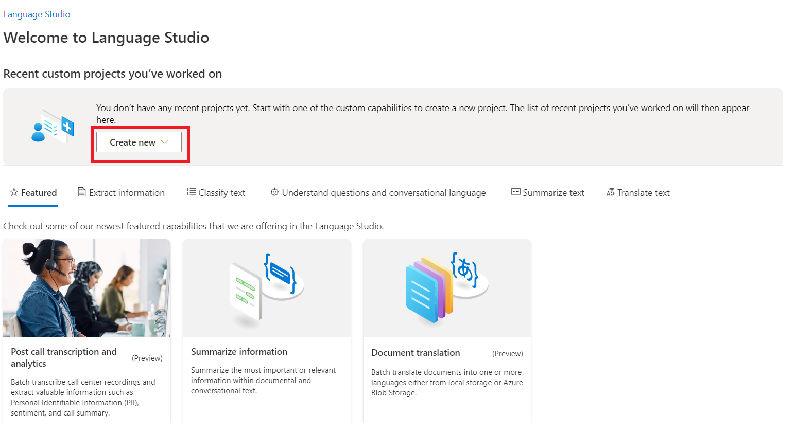

# Análise de sentimento e mneração de opiniões através do Azure Machine Learning
_Projeto realizado para a Certificação IA900 oferecida pela Microsoft em parceria com a DIO - Digital Innovation One_

---
## O Language Studio

O _Language Studio_ é uma ferramenta que compõe o serviço de linguagem de IA do Azure, que faz PLN (Processamento de Linguagem Natural) para entender e analisar texto. Especificamente, o _Language Studio_ se baseia na na Web, APIs REST e em bibliotecas de clientes.

---
## Criando um Recurso
---
Primeiro, acesse sua conta Azure (pelo portal Azure) e clique em _Create a resource_.

No menu lateral esqurdo clique em _AI + Machine Learning_. A busca te retornará todos os serviços dessa seção. Escolha o _language service_ e clique em _create_.

Clique em _Continue to create your resource_.

O Azure solicita que você preencha alguns dados, como o _Subscription_,  _Resource group_, _Region_. Além disso, você criar um nome (no meu caso, _ProjetoPNL_).

Em _Princint tier_, selecione o _Free F0_. E não esqueça de marcar a _checkbox_, onde você concorda com os termos do Azure AI Services. Por fim, clique em _Review + create_.

Clique em _Create_ e aguarde.

Aguarde aparecer a mensagem _Your deployment is complete_.

***
## Acessando o Languagem Studio

Após a criação e configuração do _Resource group_, acesse o _Language Studio_, pelo link language.cognitive.azure.com. 

A página te dá boas-vindas.

O _Language Studio_ pede que você escolha o _diretório_, a _subscription_, o _resource type_ e o _resource name_. Preencha com os dados do recurso que foi criado no portal do Azure e clique em _Done_.

***
## Acessando a ferramenta Text Analytics API's Sentiment Analysis

Clique em _Create new_.

Escolha a ferramenta que deseja utilizar - no meu caso, eu seleciono o _Classify text_ e a API _Analyze sentiment and mine opinions_.

No _Text Analytics API's Sentiment Analysis_, eu envio um texto na área indicada (É só Copiar e Colar), fazer a marcação da _checkbox_ e clicar  em _Run_.

---
## Análise dos textos enviados para o Text Analytics API's Sentiment Analysis
---

- **Texto 01**: Uma informação sobre a previsão do tempo. O _Language_ reconheceu como 97% neutro e 2% como positivo, já que será um dia com sol.

- **Texto 02**: Pequena biografia da Ada Lovelace, considerada a primeira programadora. O _Language_ reconheceu a maior parte do texto como neutra, um pouco positiva e também um pouco negativa - pode ser por causa da palavra _died_, que indica que ela morreu.

- **Texto 03**: Uma avaliação da Avenida Paulista retirada do TripAdvisor, que é claramente negativa. O _Language_ reconheceu como negativa - apesar de não ter explicitamente palavras negativas. O texto possui termos como "has the potencial", "instead has", "closed off", além da última frase ("Shopping isn't fantastic, neither is dining options") que mostram a insatisfação do turista.

- **Texto 04**: Uma segunda avaliação da Avenida Paulista retirada do TripAdvisor. O _Language_ reconheceu como positiva, mas a considero negativa. O texto começa falando bem da Paulista, porém o turista utiliza uma frase ("but I simply do not understand what the excitement is about. It is all business buildings, no restaurants and no place to 'hang out' ")que indica sua visão negativa da Paulista.

- **Texto 05**: Uma terceira avaliação da Avenida Paulista retirada do TripAdvisor, desta vez que é positiva. O _Language_ reconheceu o texto como totalmente positivo - a presença da palavra "great" que reforça essa ideia.

- **Texto 06**: O texto traz a definição do termo "Anarco-capitalismo" na _Enciclopédia Britannica_. O _Language_ considerou o texto negativo e um pouco neutro - acredito que sejam pelas críticas ao estado.

---
## Conclusões
---
O _Language_ tem um pouco de dificuldade de reconhecer algumas expressões, quando não há presença de palavras que deixam claro o sentimento que o interlocutor quer passar. Mas que não possa ser treinado e ajustado, e ele é uma excelente ferramenta para análise de textos.

---
## Fontes/Links Úteis
---
- **Portal do Azure.** Disponível em: https://azure.microsoft.com/pt-br/, Acesso em: 07 de Abril de 2024.
- **O que é a Linguagem de IA do Azure?** Disponível em: https://learn.microsoft.com/pt-br/azure/ai-services/language-service/overview, Acesso em: 07 de Abril de 2024.
- **O que é análise de sentimento e mineração de opiniões?** Disponível em: https://learn.microsoft.com/pt-br/azure/ai-services/language-service/sentiment-opinion-mining/overview?tabs=prebuilt, Acesso em: 07 de Abril de 2024.
- **Analyze text with Language Studio** Disponível em: https://microsoftlearning.github.io/mslearn-ai-fundamentals/Instructions/Labs/06-text-analysis.html, Acesso em: 07 de Abril de 2024.
